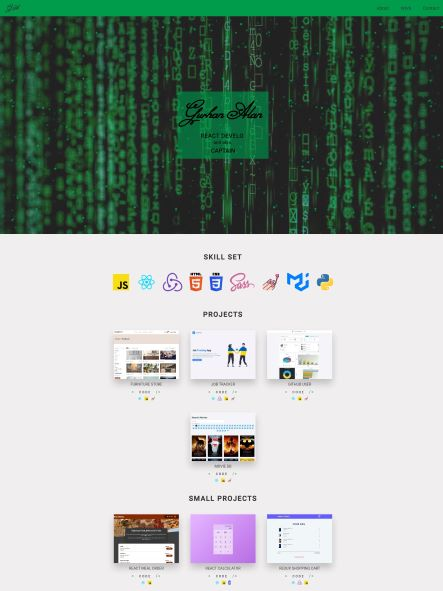

# React - Portfolio

[This project](https://gurhanalan.netlify.app) is a portfolio website. This project is built with react and redux.

## Table of contents

- [React - Portfolio](#react---portfolio)
  - [Table of contents](#table-of-contents)
  - [Overview](#overview)
    - [The challenge](#the-challenge)
    - [Screenshots](#screenshots)
    - [Links](#links)
  - [My process](#my-process)
    - [Built with](#built-with)

## Overview

### The challenge

Users should be able to:

- Get the list of jobs from API call
- Filter and sort the jobs by using buttons
- Add jobs to jobs list
- See charts of the job applications

### Screenshots

 

### Links

- Solution URL: [Live Website](https://gurhanalan.netlify.app)

## My process

### Built with

- React
- Functional Components
- React Hooks
- Sass
